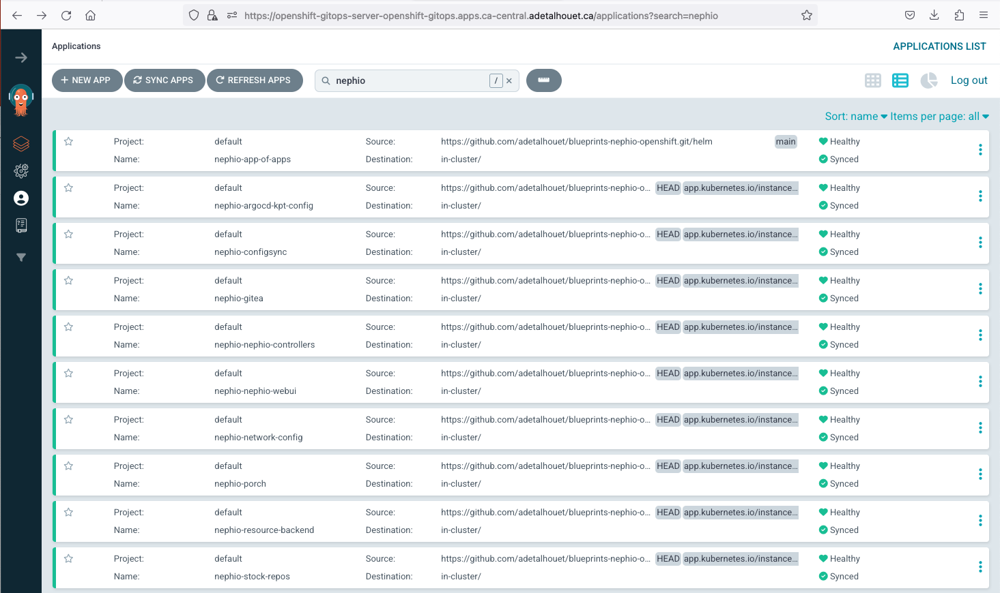
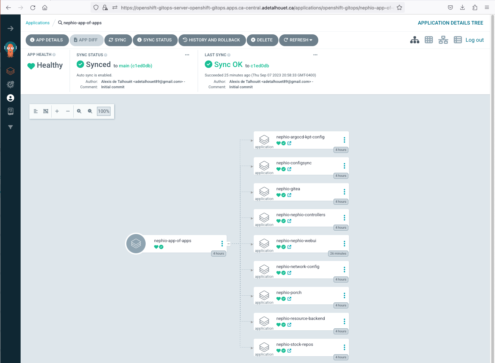

> :heavy_exclamation_mark: *Red Hat does not provide commercial support for the content of these repos*

```bash
#############################################################################
DISCLAIMER: THESE ARE UNSUPPORTED COMMUNITY TOOLS.

THE REFERENCES ARE PROVIDED "AS IS", WITHOUT WARRANTY OF ANY KIND, EXPRESS OR
IMPLIED, INCLUDING BUT NOT LIMITED TO THE WARRANTIES OF MERCHANTABILITY,
FITNESS FOR A PARTICULAR PURPOSE AND NONINFRINGEMENT.
#############################################################################
```


# Blueprint for Nephio deployment on OpenShift
  This repository provides standard Nephio packages for OpenShift-based installations.

# Nephio R1 release

These packages provide all the required components to deploy Nephio R1 release.

In you management cluster, apply the app of apps. This will create all the various component by pulling their respective kpt package from Nephio repos, and apply some OpenShift specific configuration. Each component is deployed one after the other through the use of sync-wave.

```
kubectl apply -f nephio-mgnt/app-of-apps.yaml
```

Once ArgoCD and our kpt plugin have fully rendered and applied the Nephio packages, you should have the following results in ArgoCD.



## Access the Nephio

- Get the Nephio URL:
  ```
  oc get route nephio -n nephio-webui -o=jsonpath=https://'{.spec.host}'
  ```

- Login using your OpenShift login

## Access the Gitea UI

- Get the Gitea URL:
  ```
  oc get route gitea -n gitea -o=jsonpath=https://'{.spec.host}'
  ```

- Login
    - user: gitea
    - password: passowrd

# How it works

This repository is composed of 3 main elements:
- the [kpt Configuration Management Plugin for ArgoCD](argocd-kpt-config/plugin/README.md)

  Nephio heavily relies on kpt to package, render, mutate, validate and generate Kubernetes objects. ArgoCD doesn't currently have a built-in plugin for it. As such, this repo introduce a plugin specifically built for Nephio, incorporating the various kpt functions in order to render kpt package pipeline properly.

- the Nephio components: each of them are pointing to the upstream component version, to avoid forking, and have been complemented with OpenShift-specific objects or replacements.

- the [helm](helm) chart whose purpose is to generate an ArgoCD Application for each individual component, acting as an app-of-apps

  Through its [`values.yaml`](helm/values.yaml) file, you can select which components to deploy
  ```helm
  config:
    repoURL: https://github.com/adetalhouet/blueprints-nephio-openshift.git

  blueprints:
    00-argocd-kpt-config:
      enabled: true
    01-gitea:
      enabled: true
    02-configsync:
      enabled: true
    03-porch:
      enabled: true
    04-network-config:
      enabled: true
    05-resource-backend:
      enabled: true
    06-nephio-controllers:
      enabled: true
    07-stock-repos:
      enabled: true
    08-nephio-webui:
      enabled: true
    09-mgnt-config:
      enabled: true
  ```

  Here is the expected result in ArgoCD
  